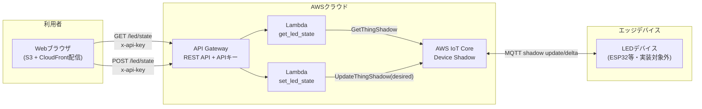

# led_iot

単一LEDのON/OFFをWebブラウザから遠隔制御するIoTシステムの最小構成たたき台です。

- 認証方式: APIキー（簡易認証）
- フロントエンド配信: S3 + CloudFront
- デバイス状態管理: AWS IoT Core Device Shadow
- IaC構成: **Lambda・IAMロール・API Gateway本体はAWS SAM**、**API Gatewayのルーティング/統合はOpenAPI**、**IoT Core・APIキー/使用量プラン・フロントエンド配信はTerraform**

## 全体構成



詳細は [docs/architecture.md](docs/architecture.md) を参照してください。

## フォルダ構成

```
led_iot/
├── docs/
│   └── architecture.md      構成図・コンポーネント詳細
├── backend/
│   ├── lambda/
│   │   ├── get_led_state/   LED状態取得Lambda
│   │   └── set_led_state/   LED状態更新Lambda
│   ├── sam/
│   │   ├── template.yaml    SAMテンプレート(Lambda/IAM/Permission/API本体)
│   │   ├── openapi.yaml     API Gatewayルーティング/統合定義
│   │   └── samconfig.toml   SAM CLIデプロイ設定
│   └── requirements.txt
├── frontend/
│   ├── index.html           操作パネル画面
│   ├── style.css
│   ├── app.js
│   └── config.example.js    API接続情報テンプレート
├── edge/
│   ├── irrp.py              赤外線送受信スクリプト(pigpio公式)
│   └── codes.json           記録された赤外線データ
└── infra/
    └── terraform/           IoT Core・APIキー/使用量プラン・フロントエンド配信(IaC)
```

## クイックスタート

IoT CoreとAPIキー/使用量プランはTerraform、Lambda・API Gateway本体はAWS SAMで管理しているため、
以下の順序でデプロイします（SAM側のAPIキー要件チェックがTerraform側のAPIキーIDを参照するわけではありませんが、
Terraformの使用量プランはSAMデプロイ後のCloudFormationスタック出力を参照するため、順序が重要です）。

事前に [AWS SAM CLI](https://docs.aws.amazon.com/serverless-application-model/latest/developerguide/install-sam-cli.html) をインストールしてください。

### 1. Terraformで IoT Core を先行デプロイし、エンドポイントを取得

```bash
cd infra/terraform
terraform init
terraform apply \
  -target=aws_iot_thing.led_device \
  -target=aws_iot_policy.device_policy \
  -target=data.aws_iot_endpoint.data_ats
terraform output -raw iot_data_endpoint
```

### 2. SAMでバックエンド（Lambda・API Gateway）をデプロイ

```bash
cd ../../backend/sam
SET PYTHONUTF8=1
sam build
sam deploy --guided \
  --parameter-overrides \
    ProjectName=led-iot \
    Environment=dev \
    ThingName=led-device-01 \
    IotDataEndpoint=<手順1で取得したエンドポイント>
```

初回は `--guided` でスタック名・リージョン等を対話設定すると `samconfig.toml` に保存されます。
2回目以降は `sam deploy` のみで再デプロイできます。

### 3. Terraformで残りのリソース（APIキー/使用量プラン・フロントエンド配信）をデプロイ

```bash
cd ../../infra/terraform
terraform apply
```

`sam_stack_name` 変数（デフォルト`led-iot-backend`）が手順2のスタック名と一致していることを確認してください。
出力から `api_base_url`、`api_key_value`（`terraform output -raw api_key_value`）、
`cloudfront_domain_name`、`frontend_bucket_name` を控えます。

### 4. フロントエンド設定を反映

```bash
cd ../../frontend
cp config.example.js config.js
# config.js を開き apiBaseUrl / apiKey を terraform output の値で書き換える
```

### 5. フロントエンドをS3にアップロード

```bash
aws s3 sync . s3://<frontend_bucket_name> --exclude "config.example.js"
```

CloudFrontの `cloudfront_domain_name` にアクセスすると操作パネルが表示されます。

### 6. デバイス側（実装対象外）

本たたき台はクラウド側のみが対象です。実機（ESP32等）は、Terraformで発行したIoT Thingの証明書を使って
MQTTでシャドウの `delta` トピックを購読し、`reported` を更新する実装を別途追加してください。
証明書発行は `aws iot create-keys-and-certificate` 等で行い、
`infra/terraform/iot.tf` 内のコメントを参考に `aws_iot_thing_principal_attachment` 等を追加してください。

## 未実装・今後の検討事項（たたき台のためスコープ外）

- デバイス証明書の発行・ローテーション
- 認証強化（Cognito等へのアップグレード）
- 複数デバイス対応（現状は単一Thing固定）
- CI/CDパイプライン（Terraform applyとSAM deployの実行順序を自動化する仕組み）
- Lambda・フロントエンドの自動テスト
