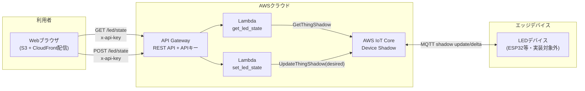
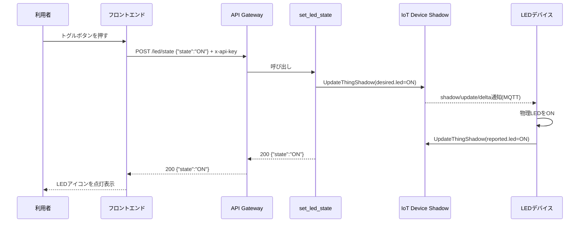

# アーキテクチャ詳細

## 構成図

## 状態更新シーケンス（LEDをONにする場合）

## コンポーネント一覧

| コンポーネント | 役割 | 主な実装場所 | IaC管理 |
|---|---|---|---|
| フロントエンド | LEDのON/OFF操作・状態表示 | `frontend/` | Terraform（S3+CloudFrontのみ。中身は手動/CI配置） |
| API Gateway（本体・ルーティング） | REST APIリソース、Lambdaプロキシ統合 | `backend/sam/openapi.yaml` | AWS SAM（OpenAPI経由） |
| APIキー・使用量プラン | `x-api-key`ヘッダによるアクセス制御 | `infra/terraform/api_gateway.tf` | Terraform（SAMデプロイ後のCFNスタック出力を参照） |
| get_led_state | Shadowの`reported`状態を取得して返す | `backend/lambda/get_led_state/handler.py` | AWS SAM |
| set_led_state | Shadowの`desired`状態を更新する | `backend/lambda/set_led_state/handler.py` | AWS SAM |
| Lambda実行ロール・Permission | Lambda実行権限、API Gatewayからの呼び出し許可 | `backend/sam/template.yaml`（Policies/Events） | AWS SAM |
| IoT Core Device Shadow | デバイスの目標状態(desired)と実際の状態(reported)を保持 | `infra/terraform/iot.tf` | Terraform |
| LEDデバイス | Shadowのdeltaを購読し物理LEDを制御（本たたき台では未実装） | 対象外 | 対象外 |

## APIエンドポイント仕様（たたき台）

### GET /led/state

- 現在のLED状態（`reported`）を返す
- ヘッダ: `x-api-key: <APIキー>`
- レスポンス例: `{"state": "ON"}`

### POST /led/state

- LEDの目標状態（`desired`）を更新する
- ヘッダ: `x-api-key: <APIキー>`
- リクエストボディ例: `{"state": "ON"}`
- レスポンス例: `{"state": "ON"}`

## 設計上の割り切り（たたき台のため）

- デバイス個別の状態を永続化するDBは持たず、IoT Device Shadowを単一の状態ストアとして利用
- デバイスは1台固定（`thing_name`変数で指定）。複数台対応時はDynamoDB等でデバイス一覧管理が必要
- 認証はAPIキーのみ。ユーザー単位の権限分離が必要な場合はCognito等への切り替えを検討
- Lambda・API Gateway本体はAWS SAM、APIキー/使用量プランとIoT CoreはTerraformと管理ツールが分かれているため、
  デプロイ順序（Terraform一部apply → SAM deploy → Terraform全体apply）に依存がある。
  `infra/terraform/api_gateway.tf` は `data.aws_cloudformation_stack` でSAMのスタック出力を参照する構成のため、
  SAMデプロイ前にTerraformの当該リソースを適用しようとするとエラーになる点に注意
